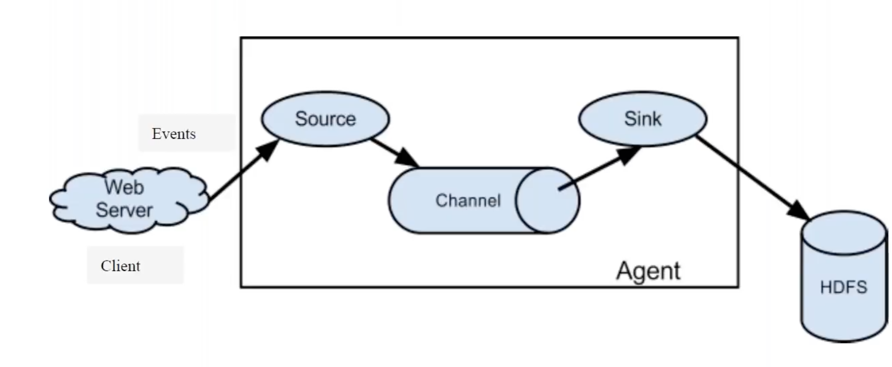
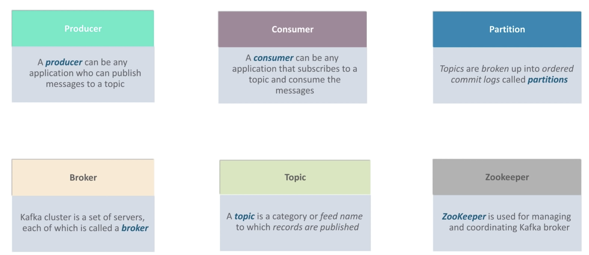
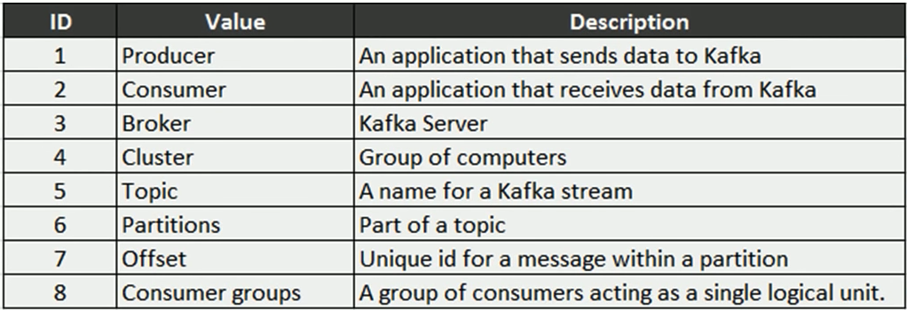
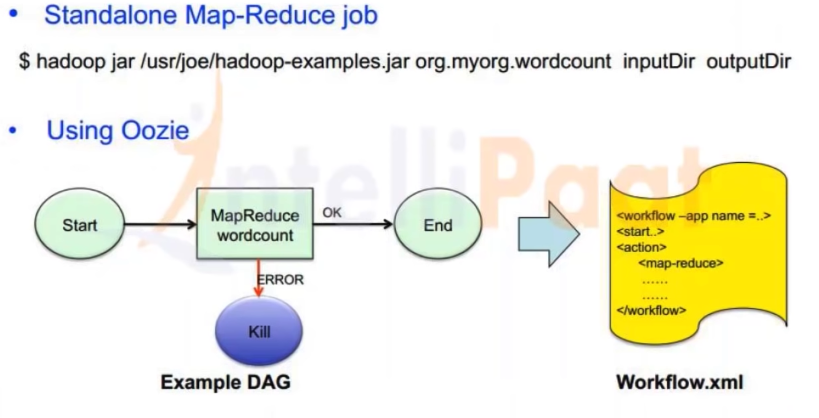
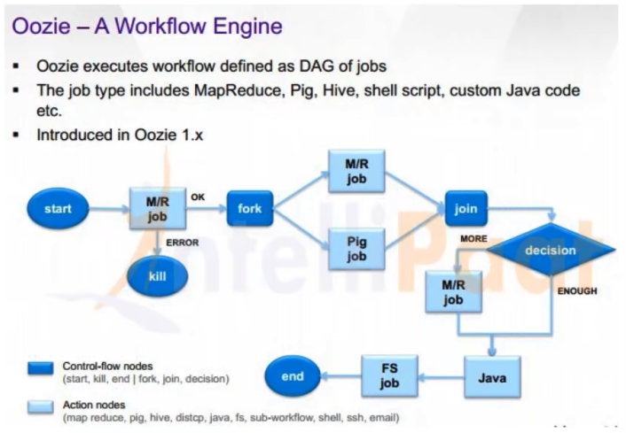
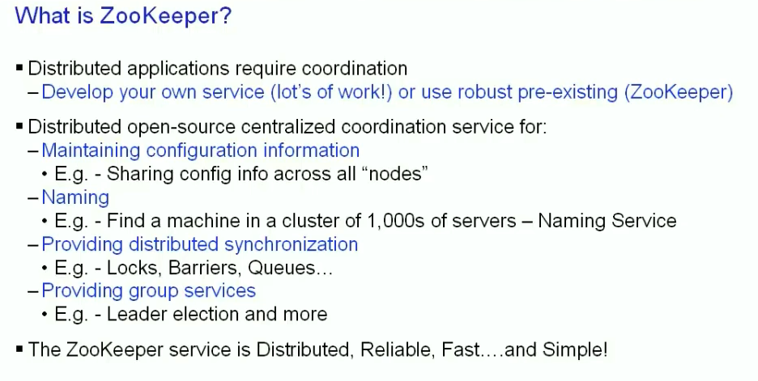
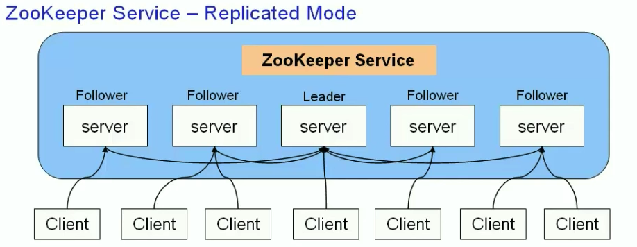

# Apache Services

## Scoop

* Import data from RDBMS , NOSQL to HDFS and vice versa
* command line to import export

## Flume

* Bring web server logs to HDFS
* Bring streaming data to HDFS
* Flume Agent
* Runs anywhere, Not required to be running on Hadoop cluster
* log4j: Flume client talk to log4j to get the log data

* Source : Source receive the data from client
* Channel: 
* Sink   : Sink pushes data to HDFS 

## Kafka

## Oozie

Workflow scheduler

## Hue

Interface on hadoop to run hive and pig scripts
Exploring HDFS

## Zookeeper

Coordinating your cluster

## Hive/Hcatalog 

* Metadata and table management system for Hadoop
* Relational view of data
* Serde ( eg. JSON) 
* metastore
* Supports HIVE DDL commands

## Solr

Solr is an open source enterprise search platform

