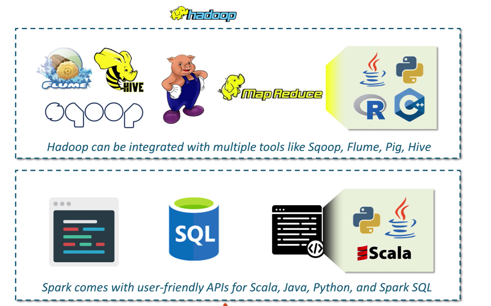
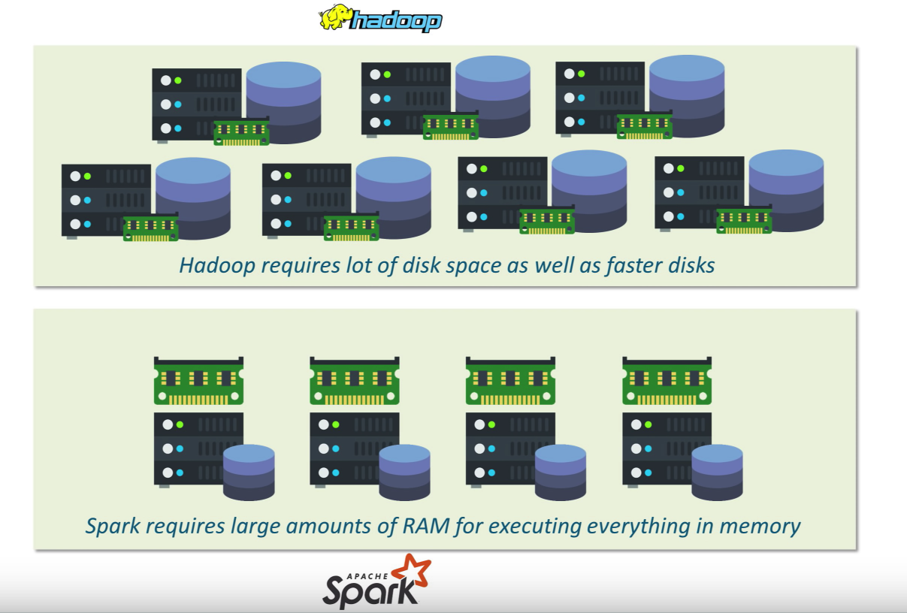

# Spark

* Polyglot ( scala, java, python,R)

Performance:

Ease of Use:

Cost:

***

> Lazy Evaluation:

> Transformation:

* RDD transformations: 
    * narrow transformation (e.g. map(), filter() etc.) 
        * does not require the shuffling of data across a partition
        * group into single stage
    * wide transformation (e.g. reduceByKey())
        * data shuffles
        * results in stage boundaries.

* Actions:

> RDD lineage

if we call val b=a.map() on an RDD, the RDD b keeps a reference to its parent RDD a

# Spark Streaming

