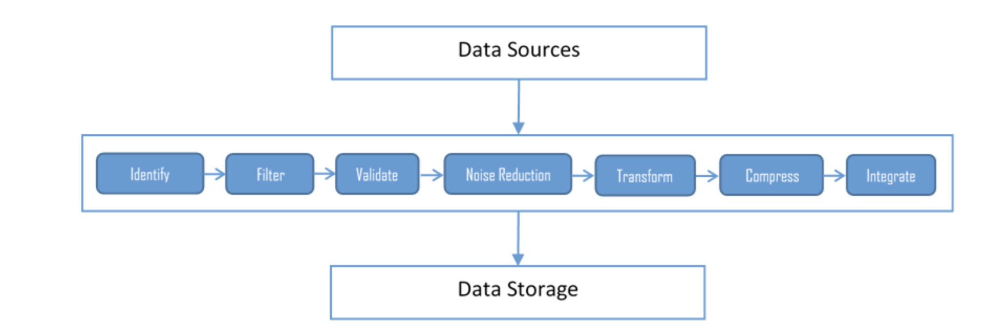
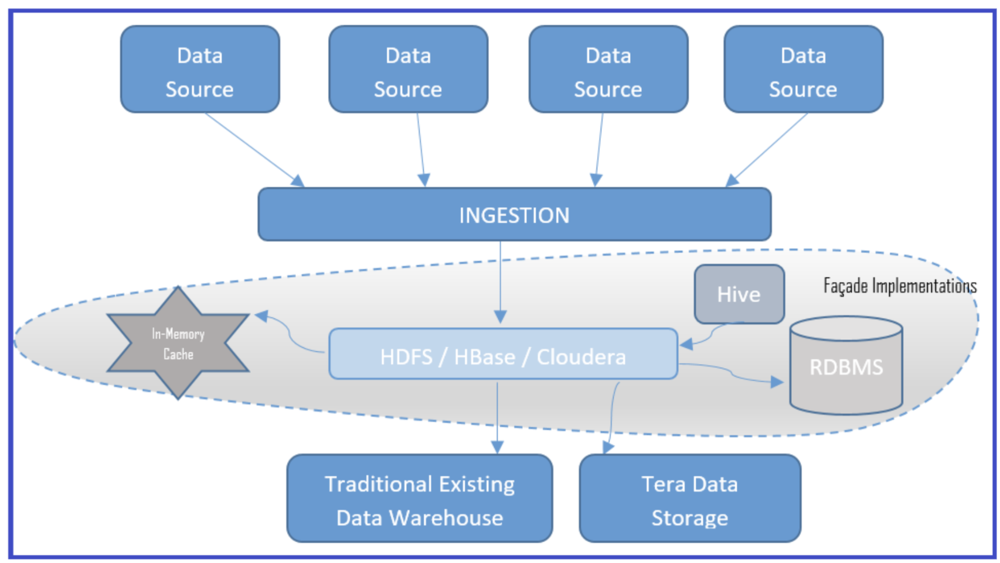
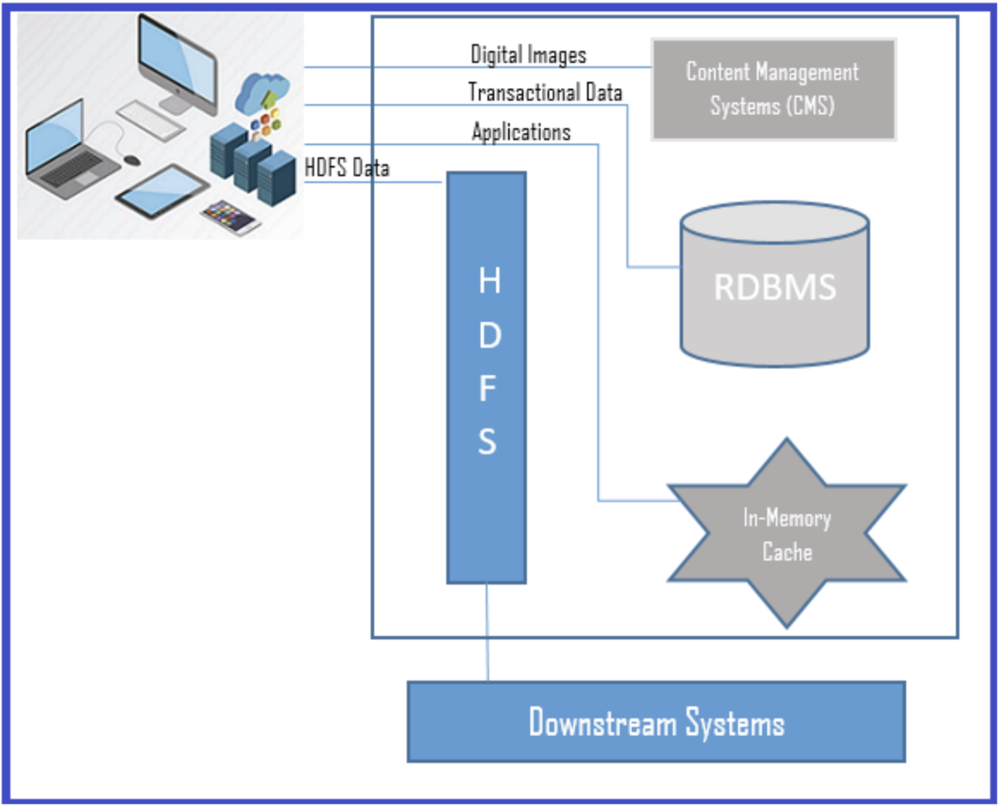

* data sources and ingestion layer
* data storage layer
* data access layer

* non-relevant information (noise) 
* relevant (signal) data

# Data sources and ingestion layer
Enterprise big data systems face a variety of data sources
* non-relevant information (noise) 
* relevant (signal) data. 

Noise ratio is very high compared to signals, and so filtering the noise from the pertinent information, handling high volumes, and the velocity of data is significant. This is the responsibility of the ingestion layer. The common challenges in the ingestion layers are as follows:

* Multiple data source load and prioritization
* Ingested data indexing and tagging
* Data validation and cleansing
* Data transformation and compression

* Multisource extractor
* Multidestination
* Protocol converter
* Just-in-time (JIT) transformation
* Real-time streaming pattern

data velocity

data size

data frequency

unreliable network

mixed network bandwidth

## Multisource extractor

## Multidestination
publishers as well as subscribers

# Data storage layer

## Basically available, soft state, eventually consistent (BASE)

* Façade pattern
* NoSQL pattern
* Polyglot pattern

## Façade pattern:
the data from the different data 
sources get aggregated into HDFS before any transformation, or even before loading to the traditional existing data warehouses

he façade pattern allows structured data storage even after being ingested to HDFS in the form of structured storage in an RDBMS, or in NoSQL databases, or in a memory cache. The façade pattern ensures reduced data size, as only the necessary data resides in the structured storage, as well as faster access from the storage.

## NoSQL pattern

* Column-oriented DBMS: Redshift, MS SQL Server
* Key-value pair database : DynamoDB
* Graph database : Neptune Neo4j
* Document database: MongoDB, Apache Elastic Search, Apache SOLR

## Polyglot pattern
Traditional (RDBMS) and multiple storage types (files, CMS, and so on) coexist with big data types (NoSQL/HDFS) to solve business problems

Most modern business cases need the coexistence of legacy databases. At the same time, they would need to adopt the latest big data techniques as well.

# Data access layer

JDBC connections and HTTP access for documents however, in big data, the data access with conventional method does take too much time to fetch even with cache implementations, as the volume of the data is so high.

* Connector pattern
* Lightweight stateless pattern
* Service locator pattern
* Near real-time pattern
* Stage transform pattern

