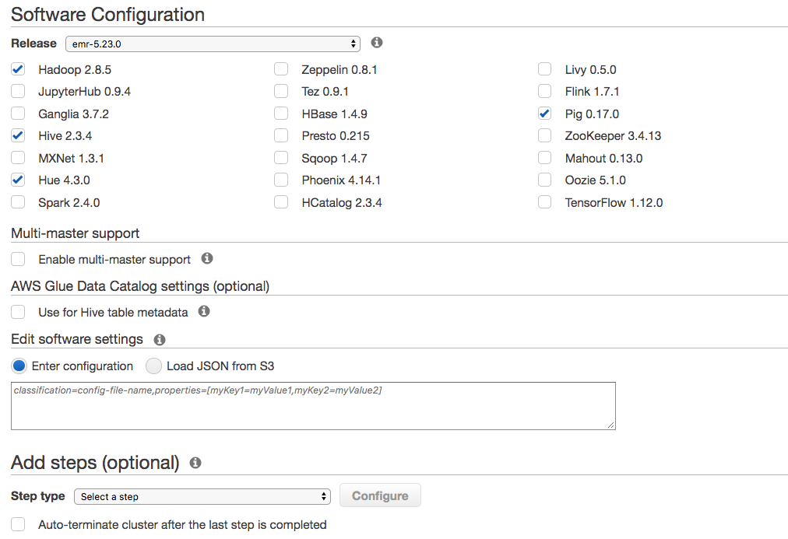

# EMR Concepts

## EMR Available Services

## Autoscaling

Scalable yarn based frameworks (Spark, Hadoop, Tez)

* Cloudwatch: 
    * Yarn Memory Available percent
        * Remaining memory available to yarn
        * Allocate if low
    * Containers pending ratio
        * Ratio of pending containers to containers allocated
        * Allocate if high
        

  
        