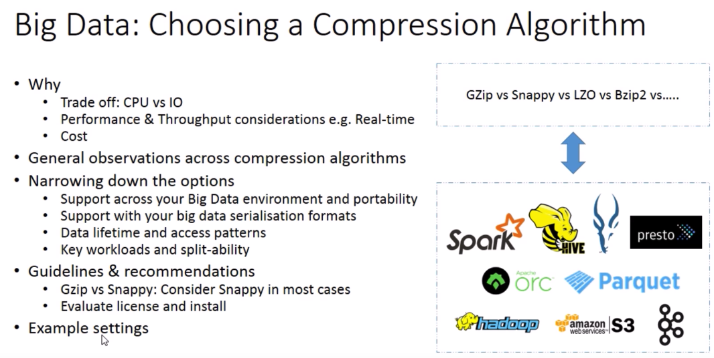

# Compressions

* Compression Ratio
* Throughput
* Compression Speed
* De-Compression Speed : while accessing data
* Memory :  

## Gzip : 
* cold data
* Not Splitable 
* NOT GOOD FOR MAPREDUCE
* more CPU higher compression ratio
* only one map task ( no paralle )
* MAP is take longer to complete

## LZO
* not installed as default
* license model
* splitable if indexed

## Snappy : 
* hot data
* used in most cases
* faster in decompression compared to LZO

## BZIP2
* splitable
* slower than GZIP
* good for mapreduce
* parallel map task

## options

* store the file uncompressed
* split file into chunks and compress each chunk
* use a compression format that supports splitting
* use a container file format that supports both compression and splitting
* AVRO and PARQUET