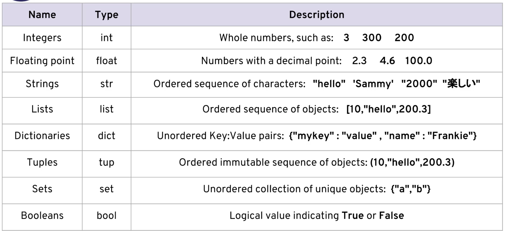
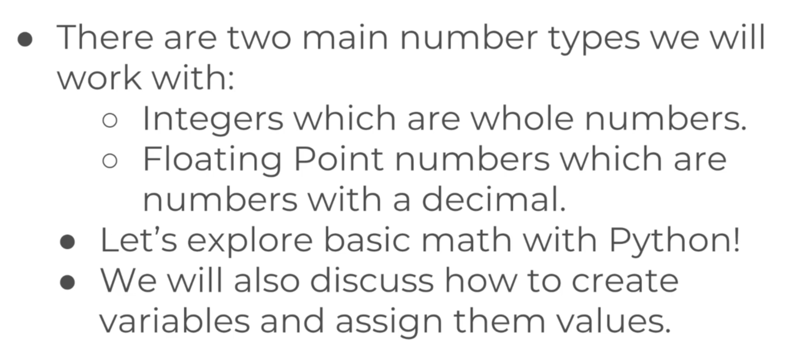
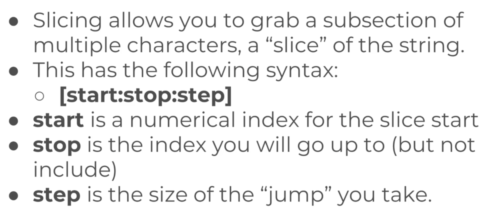
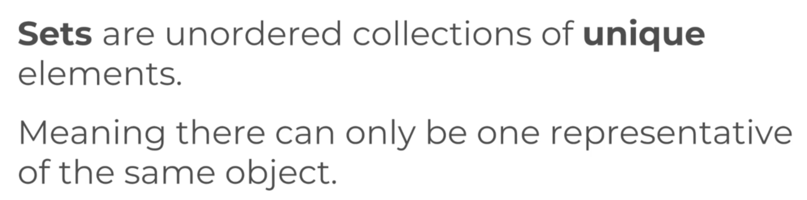
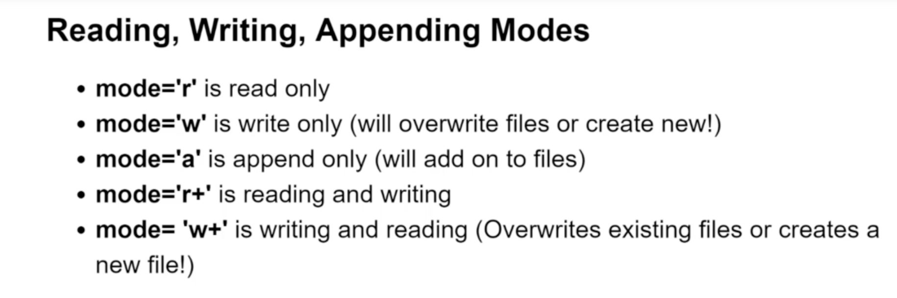

# DataTypes:

Name | Brace | Unique | Immutable
--- | --- | --- | ---
Dictionary | {} | NO | NO
List |[] | NO | NO
Tuple | ()| NO | YES
Set | {}| YES | NO

## Numbers:

## Strings:

## List and Dictionaries:

## Tuples:

## Sets:

## File Modes:
