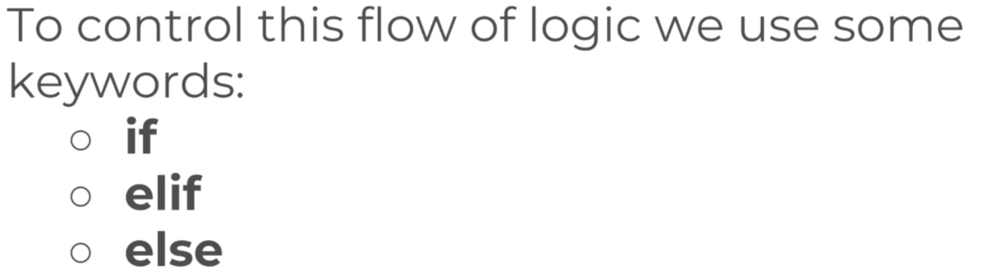
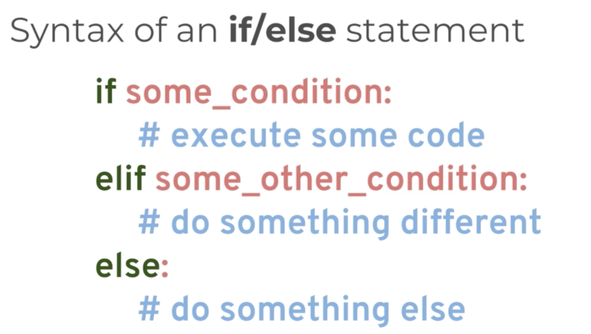
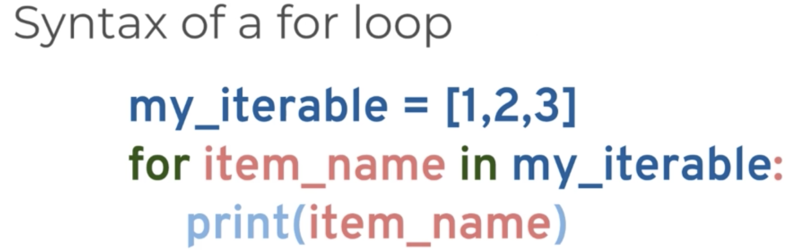
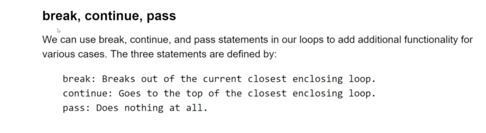

# Statements

## While

## Useful operators

Range: Gives list from range provided

Enumerate : create dictionary with key value 

zip: zips two list. Output number is the smallest of zipped lists

in:

random:

input: get input from user( always stores as string)
